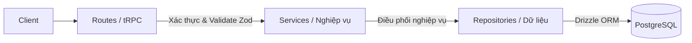

# Hướng dẫn Phát triển Backend (Backend Development Guide)

Tài liệu này định nghĩa các quy tắc thiết kế lớp (Layered Architecture), quy chuẩn lập trình (Code Style), và các chuẩn mực xử lý dữ liệu phía Server trong dự án **VaniStudio**.

---

## 1. Kiến trúc phân lớp (Layered Architecture)

Mã nguồn backend bắt buộc phải tuân thủ nghiêm ngặt mô hình phân tách 3 lớp độc lập: **Routes (API) -> Services (Nghiệp vụ) -> Repositories (Dữ liệu)**.



### 1.1. Lớp Định tuyến (Route Layer)
- **Vị trí**: `src/server/routes/`
- **Nhiệm vụ**:
  - Tiếp nhận yêu cầu từ client qua giao thức tRPC.
  - Thực hiện xác thực người dùng (`getServerSession(true)`) và kiểm tra quyền admin (`ensureAdmin()`).
  - Định nghĩa kiểu dữ liệu đầu vào (Request Input Validation) bằng schema **Zod**.
  - Bắt lỗi ngoại lệ (try-catch) và ném lỗi có cấu trúc (`TRPCError`) cho client hiển thị thông qua toast hoặc UI tương tác.
- **Quy tắc**:
  - Giữ các hàm định tuyến cực kỳ gọn (thin handler). Không viết code SQL, không viết logic xử lý nghiệp vụ hay tính toán ở đây.
  - Phải ủy quyền công việc cho lớp Service tương ứng.

*Ví dụ chuẩn*:
```typescript
export const extensionsRouter = router({
  update: publicProcedure
    .input(z.object({ id: z.string(), isEnabled: z.boolean().optional() }))
    .mutation(async ({ input }) => {
      await ensureAdmin(); // Kiểm tra quyền admin
      try {
        return await extensionsService.updateExtension(input.id, { isEnabled: input.isEnabled });
      } catch (error: any) {
        throw new TRPCError({
          code: "INTERNAL_SERVER_ERROR",
          message: error.message || "Không thể cập nhật gói mở rộng",
        });
      }
    }),
});
```

### 1.2. Lớp Nghiệp vụ (Service Layer)
- **Vị trí**: `src/server/services/`
- **Nhiệm vụ**:
  - Xử lý nghiệp vụ chính của ứng dụng (Business Logic).
  - Kết hợp nhiều thao tác từ các repository khác nhau (Orchestration).
  - Quản lý các giao dịch cơ sở dữ liệu (Database Transactions) nếu cần thực hiện ghi dữ liệu đồng thời lên nhiều bảng.
  - Thực hiện gọi các API bên ngoài hoặc tích hợp hệ thống bên thứ ba.
- **Quy tắc**:
  - Tổ chức thành một lớp (Class) và xuất bản dạng một thực thể duy nhất (Singleton).
  - Không truy cập trực tiếp vào đối tượng HTTP Request/Response.

*Ví dụ chuẩn*:
```typescript
import { extensionsRepository } from "@/server/repositories/extensions.repository";

export class ExtensionsService {
  async updateExtension(id: string, data: { isEnabled?: boolean }) {
    // Xử lý logic nghiệp vụ trước khi ghi xuống DB
    if (id === "core_module" && data.isEnabled === false) {
      throw new Error("Không thể vô hiệu hóa mô-đun cốt lõi của hệ thống.");
    }
    return await extensionsRepository.updateExtension(id, data);
  }
}

export const extensionsService = new ExtensionsService();
```

### 1.3. Lớp Truy cập Dữ liệu (Repository Layer)
- **Vị trí**: `src/server/repositories/`
- **Nhiệm vụ**:
  - Trực tiếp tương tác với cơ sở dữ liệu sử dụng **Drizzle ORM**.
  - Thực thi các truy vấn SQL (SELECT, INSERT, UPDATE, DELETE).
- **Quy tắc**:
  - Chỉ tập trung vào việc đọc/ghi dữ liệu thô. Không chứa logic phân quyền người dùng hoặc điều hướng luồng API.
  - Tổ chức thành một lớp (Class) và xuất bản dưới dạng thực thể duy nhất (Singleton).

*Ví dụ chuẩn*:
```typescript
import { db } from "@/server/db";
import { extensions } from "@/server/db/schemas/extension.schema";
import { eq } from "drizzle-orm";

export class ExtensionsRepository {
  async updateExtension(id: string, data: { isEnabled?: boolean }) {
    const [updated] = await db
      .update(extensions)
      .set({ ...data, updatedAt: new Date() })
      .where(eq(extensions.id, id))
      .returning();
    
    if (!updated) throw new Error("Không tìm thấy gói mở rộng để cập nhật");
    return updated;
  }
}

export const extensionsRepository = new ExtensionsRepository();
```

---

## 2. Quy chuẩn Viết Code Backend (Backend Code Style)

### 2.1. Đặt tên và Kiểu dữ liệu
- Tên lớp (Class): Sử dụng định dạng **PascalCase** và kết thúc bằng hậu tố vai trò (ví dụ: `UserService`, `UserRepository`).
- Phương thức và biến: Sử dụng định dạng **camelCase** (ví dụ: `getUserById`, `updateStatus`).
- Khai báo kiểu rõ ràng: Bắt buộc định nghĩa kiểu dữ liệu trả về cho tất cả các hàm/phương thức để tận dụng hệ thống kiểm tra kiểu tĩnh (Static Type Checking) của TypeScript.

### 2.2. Kiểm soát Quyền truy cập (Security & Authentication)
- Tất cả các endpoint tRPC thuộc nhóm `/administrator/*` bắt buộc phải gọi hàm kiểm tra quyền quản trị viên ở đầu phương thức xử lý:
  ```typescript
  await ensureAdmin();
  ```
- Việc lấy thông tin người dùng hiện tại phải thông qua `getServerSession()` từ `@/lib/auth` để đảm bảo an toàn tuyệt đối và tránh giả mạo request.

### 2.3. Xử lý Lỗi (Error Handling)
- Lớp **Repository** chỉ ném các lỗi nghiệp vụ hoặc lỗi SQL cơ bản (ví dụ: `new Error("Không tìm thấy dữ liệu")`).
- Lớp **Service** xử lý và quyết định ném lỗi cụ thể ra ngoài.
- Lớp **Route** bắt toàn bộ lỗi này và bọc lại trong `TRPCError` với mã code tương thích (`UNAUTHORIZED`, `BAD_REQUEST`, `NOT_FOUND`, `INTERNAL_SERVER_ERROR`).
- **Tuyệt đối không** gửi trực tiếp stack trace hoặc thông tin nhạy cảm của cơ sở dữ liệu về client để đảm bảo tính an ninh bảo mật.

---

## 3. Quy tắc nghiêm ngặt: CẤM ĐỘ CHẾ BACKEND (No Ad-hoc / Anti-Hack Backend Rules)

Tất cả các thành viên phát triển backend phải thực thi đúng các quy chuẩn kiến trúc lớp mà không có bất kỳ ngoại lệ nào.

### 3.1. Cấm Truy Cập DB Không Qua Lớp Repository (No Raw DB queries in Services/Routes)
- **Tuyệt đối cấm** import đối tượng `db` hoặc import trực tiếp bất kỳ tệp schema nào từ `@/server/db/schemas/*` vào trong các tệp Route (`src/server/routes/`) hay tệp Service (`src/server/services/`).
- Mọi hoạt động đọc/ghi, lọc, hay thao tác dữ liệu đều bắt buộc phải được đóng gói gọn gàng bên trong lớp Repository tương ứng. Lớp Service và Route chỉ gọi phương thức của Repository.

### 3.2. Cấm Viết Logic Nghiệp Vụ Tại Lớp Route (Thin Controllers ONLY)
- Lớp Route (`src/server/routes/`) chỉ đóng vai trò là nơi tiếp nhận yêu cầu, validate định dạng đầu vào (Zod input validation) và trả về kết quả.
- **Tuyệt đối cấm** viết các tính toán logic, thay đổi trạng thái thực thể, vòng lặp điều phối phức tạp, hoặc kiểm tra điều kiện nghiệp vụ trực tiếp trong Route. Mọi logic này phải được chuyển xuống lớp Service để đảm bảo khả năng tái sử dụng và kiểm thử (Unit Test).

### 3.3. Cấm Tự Chế Bộ Xác Thực / Check Admin (Anti-Bypass Security Policy)
- **Tuyệt đối cấm** tự viết các hàm kiểm tra phân quyền quản trị viên (như kiểm tra vai trò người dùng thủ công qua chuỗi `"admin"`) rải rác ở từng file route.
- Bắt buộc phải sử dụng hàm kiểm tra chuẩn `ensureAdmin()` tập trung để đảm bảo tính an toàn hệ thống. Mọi API liên quan đến quản trị viên (`/administrator/*`) phải gọi kiểm tra phân quyền này ngay ở dòng đầu tiên của hàm xử lý.

### 3.4. Cấm Bỏ Qua Bước Validate Zod (No Bypass Input Validation)
- Tất cả API Endpoint dạng publicProcedure hay protectedProcedure nhận tham số từ client đều bắt buộc phải có bước xác thực kiểu dữ liệu đầu vào sử dụng `.input(z.object({...}))`.
- **Cấm tuyệt đối** việc định nghĩa API nhận dữ liệu không an toàn (ví dụ: `.input(z.any())` hoặc bỏ qua thuộc tính validate) để phòng ngừa triệt để các lỗ hổng tấn công chèn mã độc (SQL Injection, XSS) hoặc làm hỏng dữ liệu hệ thống.

