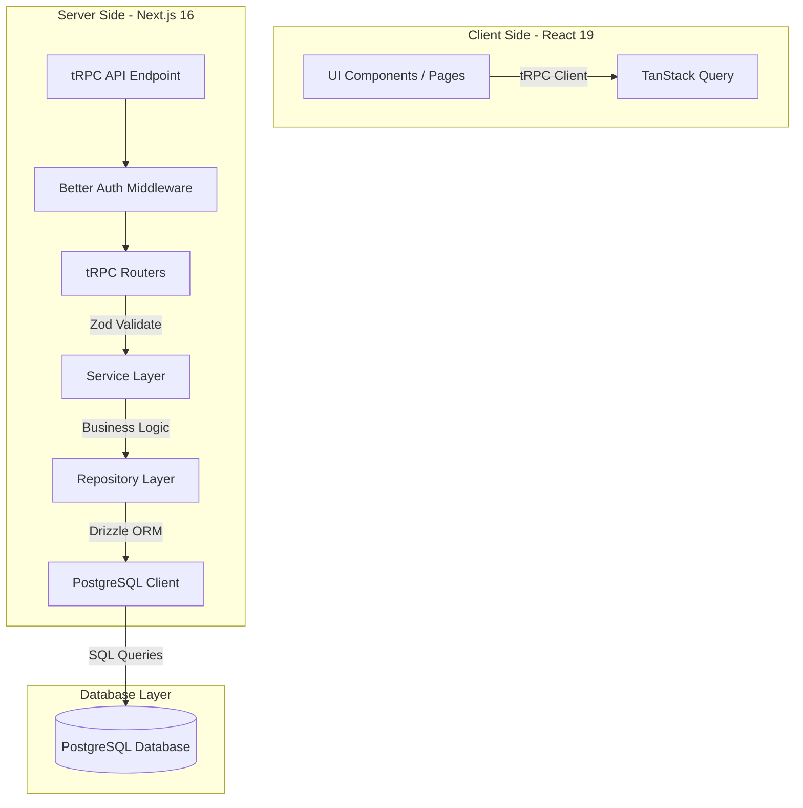

# Tổng Quan Kiến Trúc Hệ Thống (System Architecture Overview)

Tài liệu này cung cấp cái nhìn toàn cảnh về kiến trúc, các công nghệ cốt lõi và luồng dữ liệu (Data Flow) trong hệ thống **VaniStudio**.

---

## 1. Sơ đồ Kiến trúc Tổng quan (High-Level Architecture)

Hệ thống được thiết kế theo mô hình client-server hiện đại, tích hợp chặt chẽ giữa frontend và backend trong cùng một dự án Next.js (Monorepo/Unified codebase). Dữ liệu được trao đổi qua tRPC để đảm bảo tính an toàn kiểu dữ liệu (End-to-End Type Safety) từ cơ sở dữ liệu đến giao diện người dùng.



---

## 2. Các Công Nghệ Cốt Lõi (Tech Stack)

### 2.1. Frontend
- **Framework**: Next.js 16 (App Router) với cơ chế Server/Client components tối ưu.
- **Thư viện UI**: React 19, Radix UI (được Shadcn UI cấu trúc lại).
- **Styling**: Tailwind CSS v4 & PostCSS với các quy chuẩn phẳng và biến CSS hệ thống.
- **Data Fetching**: `@tanstack/react-query` thông qua lớp bọc tRPC Client.

### 2.2. Backend
- **Framework API**: tRPC (Type-safe RPC) thay thế hoàn toàn cho REST API/GraphQL truyền thống.
- **Xác thực & Phân quyền**: Better Auth với cơ chế lưu trữ session và kiểm tra quyền admin chuyên sâu.
- **ORM**: Drizzle ORM (PostgreSQL driver) giúp ánh xạ và thao tác SQL an toàn thông qua TypeScript.
- **Database**: PostgreSQL (kết nối qua thư viện `postgres-js`).

---

## 3. Luồng Đi của Dữ Liệu (Request & Data Flow)

Khi một hành động được kích hoạt ở giao diện (ví dụ: Admin xóa một dự án):

1. **Giao diện (UI Component)**: Người dùng nhấn nút xóa trong component `AdminRequestsTab.tsx`. Nút bấm kích hoạt hàm xử lý sự kiện client.
2. **Yêu cầu API (tRPC Client)**: Giao diện gọi mutation tương ứng:
   ```typescript
   deleteProjectMutation.mutate({ id: project.id })
   ```
3. **Bộ lọc & Định tuyến (tRPC Router)**: Yêu cầu đi qua router tRPC tại `src/server/routes/administrator/projects.route.ts`:
   - Xác thực phiên làm việc thông qua `getServerSession(true)`.
   - Kiểm tra vai trò admin bằng hàm `ensureAdmin()`.
   - Xác thực cấu trúc dữ liệu đầu vào (input validation) bằng schema Zod: `z.object({ id: z.string() })`.
4. **Xử lý Nghiệp vụ (Service Layer)**: Router gọi phương thức nghiệp vụ từ `projectsService.deleteProject(id)` tại `src/server/services/administrator/projects.service.ts`. Lớp này đảm nhận việc kiểm tra logic nghiệp vụ phức tạp, ghi log, kích hoạt các dịch vụ liên quan.
5. **Truy vấn Dữ liệu (Repository Layer)**: Service chuyển yêu cầu đến `projectsRepository.deleteProject(id)` tại `src/server/repositories/projects.repository.ts`. Lớp Repository trực tiếp tạo câu lệnh SQL qua Drizzle ORM:
   ```typescript
   await db.delete(projects).where(eq(projects.id, id));
   ```
6. **Lưu trữ (Database)**: Drizzle ORM biên dịch câu lệnh thành SQL thuần và gửi đến cơ sở dữ liệu PostgreSQL. Kết quả trả ngược lại theo chiều từ dưới lên để cập nhật UI Client.

---

## 4. Quy tắc Tổ chức Thư mục Hệ thống (Codebase Folder Structure)

Mã nguồn của hệ thống được tổ chức chặt chẽ và phân chia vai trò rõ ràng tại thư mục gốc `src/`:

```text
src/
├── app/                  # Định nghĩa Routing & Layout (Next.js App Router)
├── components/           # Chứa các component giao diện React
│   ├── ui/               # Component cơ bản nguyên tử (Button, Input, Card...) từ Shadcn UI
│   └── contents/         # Component chứa logic nghiệp vụ theo từng domain
│       ├── administrator/# Các component phục vụ trang quản trị (Admin Dashboard)
│       └── authentication/# Các component phục vụ trang đăng nhập, đăng ký
├── constants/            # Định nghĩa các hằng số dùng chung (ngân hàng, cấu hình mặc định...)
├── contexts/             # Quản lý React Contexts (SettingContext, AuthContext...)
├── defaults/             # Định nghĩa dữ liệu mặc định của hệ thống
├── helpers/              # Các hàm bổ trợ xử lý dữ liệu chung
├── hooks/                # Custom React Hooks chia sẻ
├── lib/                  # Nơi cấu hình và khởi tạo các client bên thứ ba (tRPC Client, db...)
├── proxies/              # Lớp middleware helper xử lý bảo mật định tuyến
├── scripts/              # Các script bảo trì, seed dữ liệu cơ sở
└── server/               # Lớp mã nguồn Backend
    ├── db/               # Kết nối Database, định nghĩa quan hệ r.ts và schemas/
    ├── routes/           # Bộ định tuyến tRPC (API endpoints)
    ├── services/         # Lớp nghiệp vụ chính (Business Logic)
    └── repositories/     # Lớp truy vấn dữ liệu trực tiếp với PostgreSQL qua Drizzle
```

Việc tuân thủ đúng phân lớp thư mục giúp toàn bộ lập trình viên và tác nhân AI xác định đúng vị trí cần thay đổi mà không tạo ra các file rác hoặc phá vỡ cấu trúc modular của dự án.

---

## 5. Quy tắc nghiêm ngặt: ĐỒNG NHẤT TOÀN DIỆN HỆ THỐNG (Anti-Deviation Policy)

Để đảm bảo hệ thống đạt độ ổn định cao và dễ bảo trì lâu dài, tất cả các thay đổi phải tuân thủ chính sách "Cấm Độ Chế" trên mọi phương diện:

### 5.1. Quy tắc Tích Hợp (Integration Rules)
- **Cấm tự ý cài đặt thêm thư viện**: Không tự ý cài đặt các thư viện npm ngoài danh sách đã có trong `package.json` trừ khi có sự phê duyệt rõ ràng từ Kiến trúc sư trưởng. Phải tái sử dụng tối đa các thư viện hiện có (ví dụ: `@iconify/react` thay vì `lucide-react`, `drizzle-orm` thay vì Prisma/SQL thuần).

### 5.2. Đồng nhất về Luồng Nghiệp vụ (Unified Execution Flow)
- Mọi tương tác làm thay đổi cơ sở dữ liệu từ client đều bắt buộc phải đi theo đúng luồng:
  `UI Component -> tRPC Mutation -> Route Input Validation (Zod) -> Service Business Logic -> Repository DB Operations -> PostgreSQL`.
- Tuyệt đối nghiêm cấm viết tắt, bypass các lớp (ví dụ: gọi trực tiếp Repository từ Route, hoặc thực thi câu lệnh DB trực tiếp trong Service) dưới mọi hình thức.

### 5.3. Bảo toàn Đồng bộ Kiểu Dữ liệu (End-to-End Type Safety)
- Tận dụng tối đa khả năng suy luận kiểu tự động của Drizzle và tRPC.
- Cấm sử dụng kiểu dữ liệu `any` hoặc viết các kiểu dữ liệu không có cấu trúc kiểm tra rõ ràng ở cả Client và Server.

